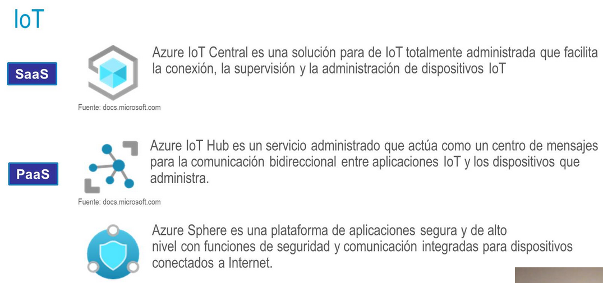
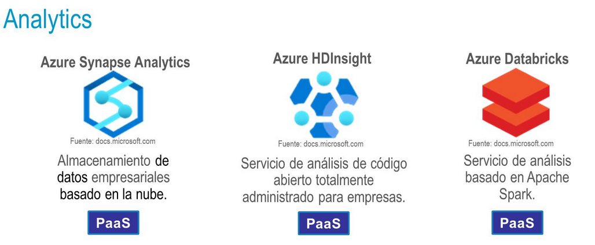
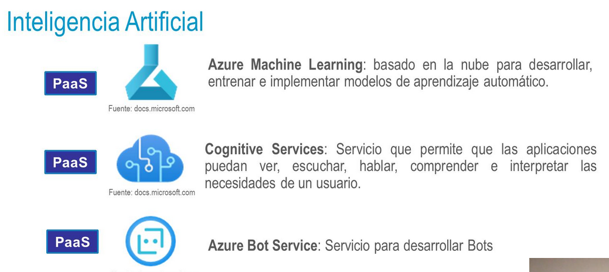
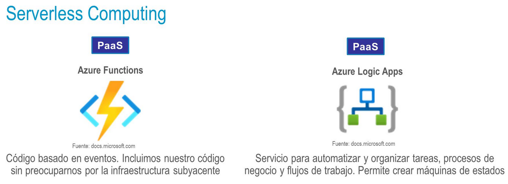

deck:: [[UNIR::Curso Azure::Módulo-3]]
tags:: UNIR, Azure

-
- ## PDF
	- 
-
-
- ## Tema 1: Soluciones principales de Azure
	- ### IoT
		- **IoT (Internet of Things)** consiste en que dispositivos convencionales estén conectados a Internet y manden mensajes a la nube.
		- Estos datos van a poder ser luego procesados por analítica o big data
		- 
	- ### Analytics
		- 
	- ### IA
		- 
	- ### Serverless Computing
		- 
	- ### DevOps
		- 
		-
-
- ## Tema 2: Herramientas de administración de Azure