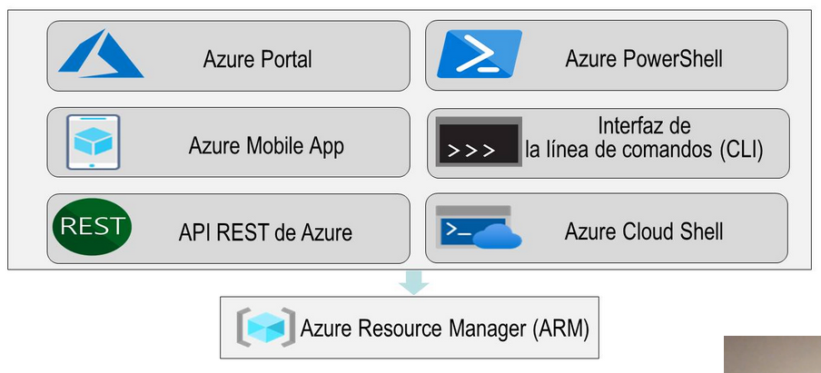

deck:: [[UNIR::Curso Azure::Módulo-3]]
tags:: UNIR, Azure

-
- ## PDF
	- 
-
-
- ## Tema 1: Soluciones principales de Azure
	- ### IoT
		- **IoT (Internet of Things)** consiste en que dispositivos convencionales estén conectados a Internet y manden mensajes a la nube.
		- Estos datos van a poder ser luego procesados por analítica o big data
		- 
	- ### Analytics
		- 
	- ### IA
		- 
	- ### Serverless Computing
		- 
	- ### DevOps
		- 
		-
-
- ## Tema 2: Herramientas de administración de Azure
	- ### Azure Portal, PowerShell, CLI, Cloud Shell, Mobile App
		- 
	- ### Azure Advisor, Azure Monitor
		- **Azure Advisor** es una herramienta de administración que se encarga de analizar todos los recursos que estamos utilizando en nuestra cuenta de Azure, independientemente del servicio.
		- Y hace recomendaciones acerca de nuestro uso particular.
		- **Azure Monitor** se encarga de recopilar y analizar todos los logs que llegan de diferentes servicios de las diferentes VMs, aplicaciones, contenedores... y llega a realizar acciones que podemos definir.
		- También podemos crear alertas
	- ### ARM
		- Son archivos JSON que permiten crear infraestructura de forma automática (IaC).
	- ### Azure Service Health
		- Es donde aparecen los servicios que están up por parte de posibles caídas de servicio.
	-