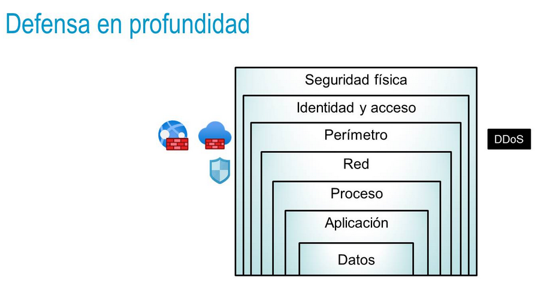
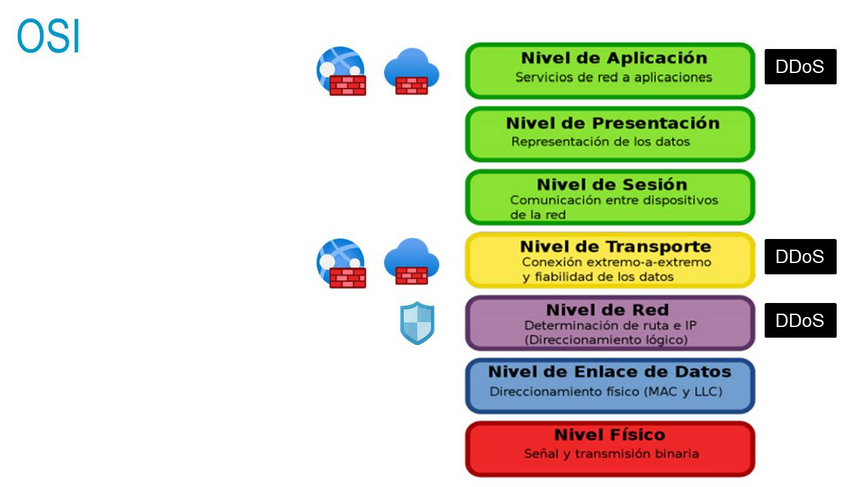

deck:: [[UNIR::Curso Azure::Módulo-4]] 
tags:: UNIR, Azure

-
- ## PDF
	- 
	-
-
- ## Tema 1: Características de Azure Security
	- ### Azure Security Center
		- Azure Security Center es un servicio de supervisión que nos va a proteger frente a accidentes y amenazas de red de CPDs locales.
		- Nos da una puntuación de nuestra seguridad
		- También bloqueará malware y posibles ataques de internet a nuestros puertos
	- ### Azure Key Vault
		- Es un almacén de secretos en la nube.
		- Permite que las aplicaciones hagan uso de valores que deben permanecer almacenados de forma segura (usuarios, contraseñas, claves de API...)
		- Todo debería estar guardado aquí.
	- ### Azure Sentinel
		- Es una herramienta SOAR que nos ayuda a tratar con diversas amenazas.
		- Recopila información de nuestras aplicaciones para buscar actividad maliciosa
	- ### Hosts dedicados
		-
-
- ## Tema 2: Conectividad de red segura
	- ### Defensa en profundidad #flashcard
	  id:: 636e2aa5-9caa-41ab-9fd7-a22462fa96b4
		- 
		- La defensa en profundidad hace referencia a un modelo por capas que nos permite asegurar un sistema.
		- Deberíamos añadir un mecanismo de seguridad en cada una de nuestras capas.
		- Si alguien consigue sobrepasar un nivel, tendrá que pasar también las otras capas
	- ### Modelo de seguridad compartida #flashcard
	  id:: 636e2aa5-32fb-4263-98bf-95f12efdd98c
		- 
	- ### Grupos de seguridad y firewall #flashcard
	  id:: 636e2aa5-5e82-434b-b745-20d86f532309
		- Filtra el tráfico de red hacia y desde los recursos de Azure en redes virtuales.
		- Las reglas empiezan a contar a partir de 100 para arriba. Más alta, menos prioritaria.
		- Un proxy inverso es un punto de entrada único a nuestro sistema para el mundo.
			- Podemos tener una aplicación con muchos microservicios pero un único punto para redirigir nuestro tráfico.
	- ### Protección frente a DDoS #flashcard
	  id:: 636e2aa5-b580-4958-ad28-3ae9299f3138
		- Azure ofrece un servicio básico de protección contra ataques de denegación de servicio básico.
			- Aunque solo filtra tráfico sospechoso y no tiene logging ni alertas. Por lo que no nos enteraremos si hemos sido protegidos o no.
		- 
		- 
		-
	-