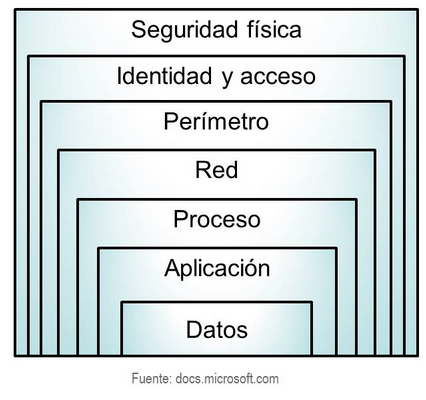
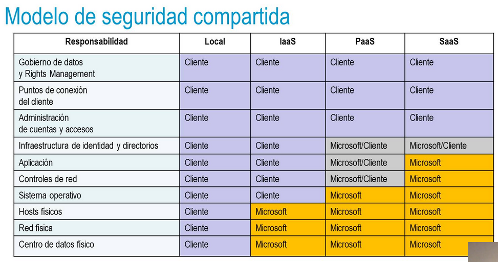

deck:: [[UNIR::Curso Azure::Módulo-4]] 
tags:: UNIR, Azure

-
- ## PDF
	- 
	-
-
- ## Tema 1: Características de Azure Security
	- ### Azure Security Center
		- Azure Security Center es un servicio de supervisión que nos va a proteger frente a accidentes y amenazas de red de CPDs locales.
		- Nos da una puntuación de nuestra seguridad
		- También bloqueará malware y posibles ataques de internet a nuestros puertos
	- ### Azure Key Vault
		- Es un almacén de secretos en la nube.
		- Permite que las aplicaciones hagan uso de valores que deben permanecer almacenados de forma segura (usuarios, contraseñas, claves de API...)
		- Todo debería estar guardado aquí.
	- ### Azure Sentinel
		- Es una herramienta SOAR que nos ayuda a tratar con diversas amenazas.
		- Recopila información de nuestras aplicaciones para buscar actividad maliciosa
	- ### Hosts dedicados
		-
-
- ## Tema 2: Conectividad de red segura
	- ### Defensa en profundidad
		- 
		- La defensa en profundidad hace referencia a un modelo por capas que nos permite asegurar un sistema.
		- Deberíamos añadir un mecanismo de seguridad en cada una de nuestras capas.
		- Si alguien consigue sobrepasar un nivel, tendrá que pasar también las otras capas
	- ### Modelo de seguridad compartida
		- 
		-
	- ### Grupos de seguridad y firewall
	- ### Protección frente a DDoS
	-