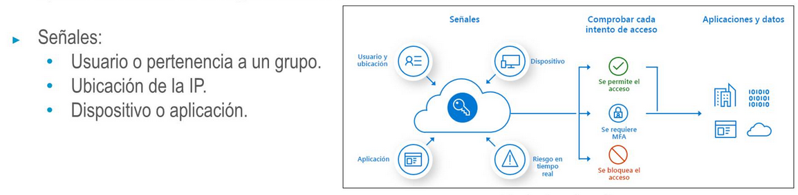

deck:: [[UNIR::Curso Azure::Módulo-5]]
tags:: UNIR, Azure

-
- ## PDF
	- 
	-
-
- ## Tema 1: Servicios principales de identidad de Azure #flashcard
	- ### Autenticación VS Autorización
		- La **autenticación** es identificar la persona o servicio que está intentando acceder a un recurso
		- Quiero identificar **quién** está accediendo a un recurso concreto
		- Se solicitan credenciales de acceso. Por ejemplo, usuario y contraseña
		- La **autorización** consiste en, sabiendo quién eres, determinar a qué datos y recursos puedes tener acceso.
	- ### Azure AD
		- Es el servicio principal que nos da Azure para administración de identidad y acceso basado en la nube de Microsoft
	- ### MFA
		- Multi Factor Authentication
		- Proporciona seguridad adicional al requerir **al menos dos o más** elementos para la autenticación completa
		- Algo que conoces + algo que posees + algo intrínseco a ti
	- ### SSO
	- ### CA
		- **Acceso Condicional**
		- Es lo que utiliza Azure Active Directory para reunir señales, tomar decisiones y aplicar directivas de la organización referentes a la autenticación.
		- 
	-
	-
- ## Tema 2: Gobernanza en Azure #flashcard
	- ### RBAC
		- **Acceso Basado en Roles**
		- Nos permite asociar un rol a un grupo de personas, un grupo de procesos, un único recurso o proceso
	- ### Bloqueos de recursos y etiquetas
		- Nos permite proteger todos nuestros recursos para no eliminarlos o para no modificarlos. Accidentalmente.
	- ### Políticas, Blueprints y CAF
		- #### Azure Policy
			- Ayuda a hacer cumplir los estándares que una organización haya definido a la hora de gestionar los recursos de las suscripciones.
			- Son reglas de alto nivel.
			- Hay predefinidas
		- #### Azure Blueprints
			- La diferencia entre blueprints y las plantillas de ARM es que ARM se centra en los recursos y Blueprints incluye muchas maś cosas. Como:
				- Roles necesarios
				- Políticas necesarios
				- Plantillas de Azure Resource Manager necesarias
				- Grupos de recursos necesarios
	-
- ## Tema 3: Privacidad, cumplimiento y estándares de protección de datos
	- ### Términos y requisitos de cumplimiento de Azure
	- ### Declaración de privacidad y condiciones de uso
	- ### Regiones soberanas
	-