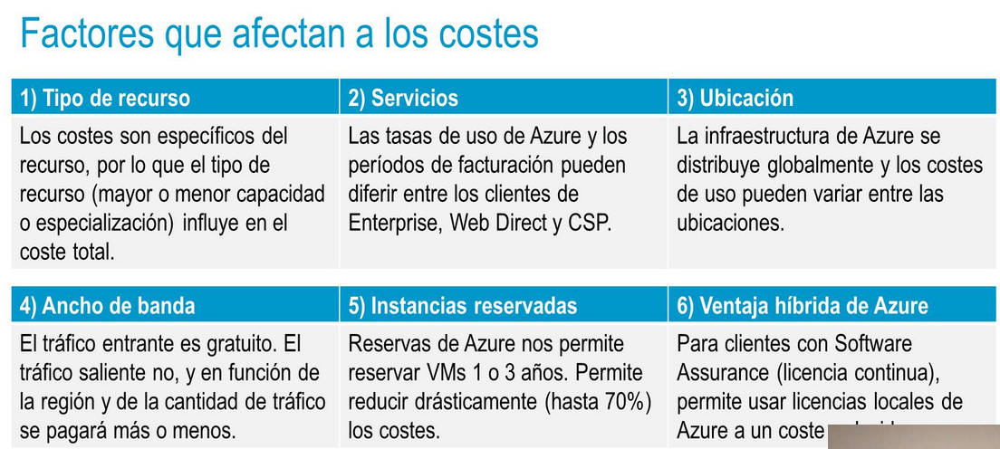
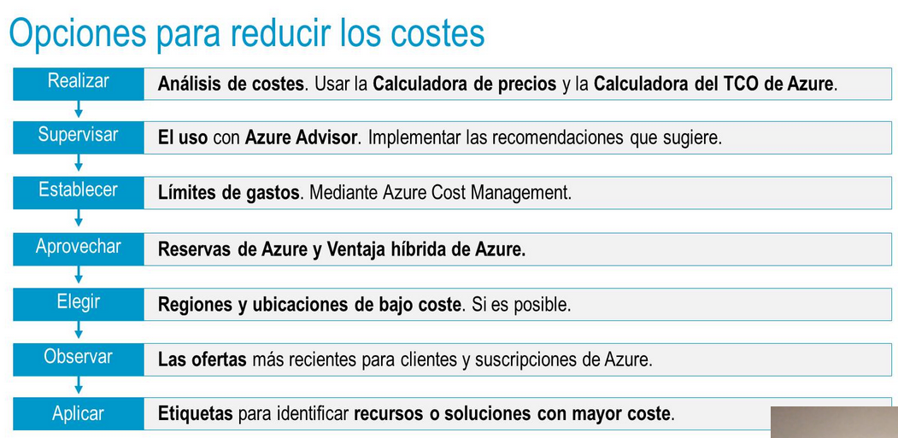
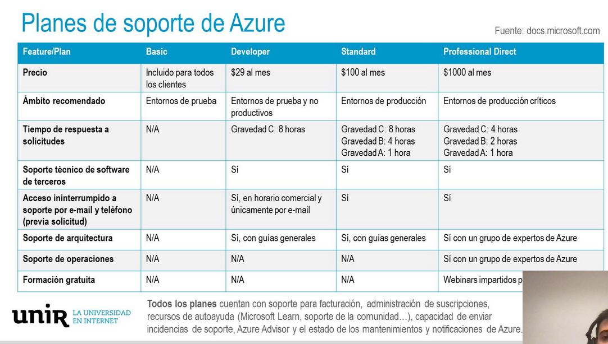

deck:: [[UNIR::Curso Azure::Módulo-6]]
tags:: UNIR, Azure

-
-
- ## PDF
	- 
	-
-
- ## Tema 1: Planificación y gestión de costes
	- ### Factores que afectan a los costes
		- 
		-
	- ### Calculadoras de coste
		- Fuera del portal de Azure ambas calculadoras.
		- Hay dos calculadoras para estimar los precios en Azure:
			- #### Calculadora de precios de Azure
				- Podemos calcular lo que nos costará tener X servicios con Y recursos.
			- #### Calculadora de coste total de propiedad (TCO)
				- Cuál sería el ahorro de migrar toda nuestra infraestructura a Azure
	- ### Azure Cost Management
		- Esta herramienta nos va a permitir gestionar todo lo relacionado con costes en nuestra suscripción.
		- También nos dará consejos sobre los costes.
	- ### Opciones para reducir los costes
		- 
-
-
- ## Tema 2: Ciclo de vida de los servicios y SLA de Azure #flashcard
  id:: 636e45cf-b2d7-4395-89f5-e586a36cbec5
	- ### SLA de Azure
		- Un **SLA (Service Level Agreement)** es un acuerdo que se establece entre una empresa y el cliente.
		- En este caso, el **SLA** de Azure hace referencia al tiempo de actividad y la conectividad de los servicios que ofrece.
		- En Azure, cada servicio tiene un SLA individual.
		- Los servicios gratuitos NO tienen SLA
	- ### Factores que afectan al SLA
		- Si queremos HA y FT, tenemos que usar distintas AZs.
	- ### Ciclo de vida de los servicios de Azure
		- **NO** se debe usar nunca betas en PROducción
	- ### Planes de soporte
		- 
		-